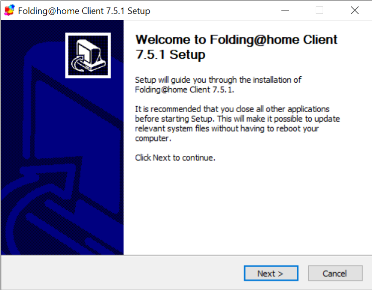
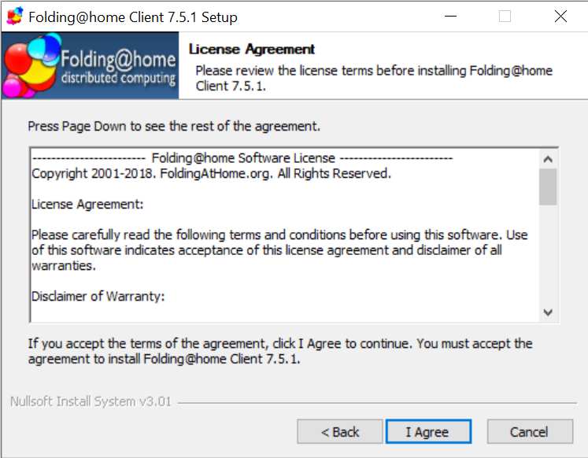
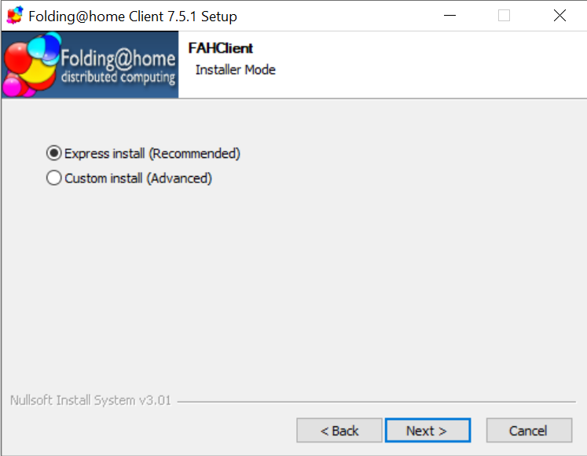
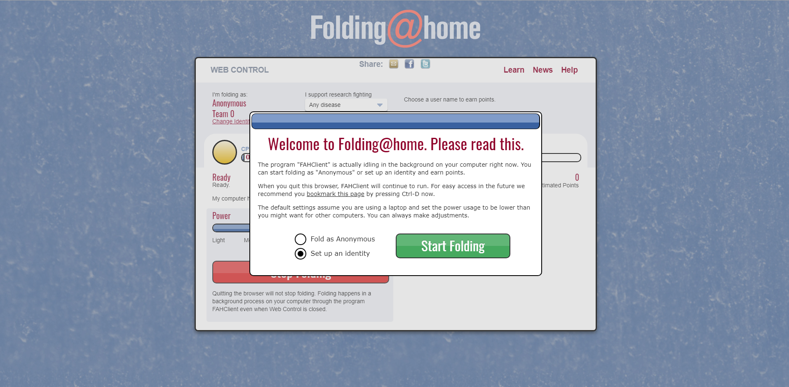
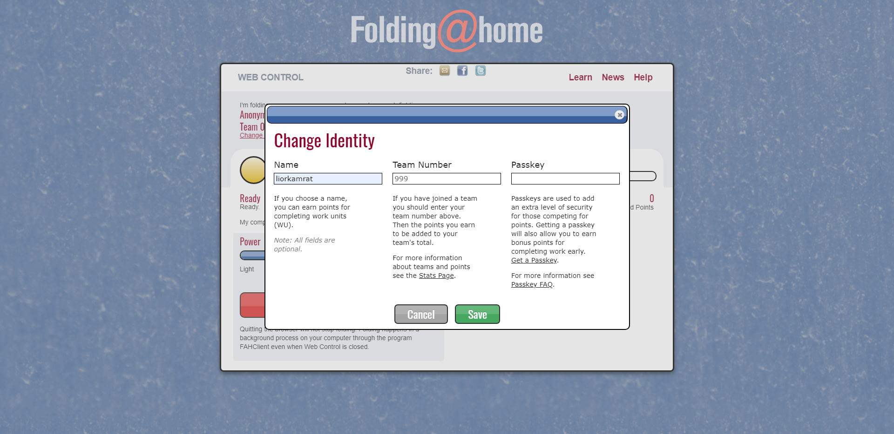
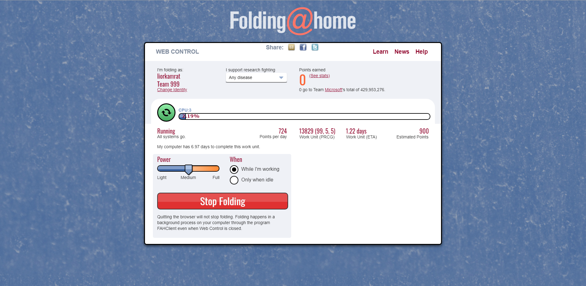
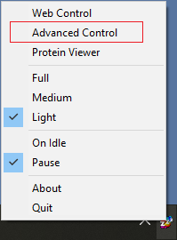
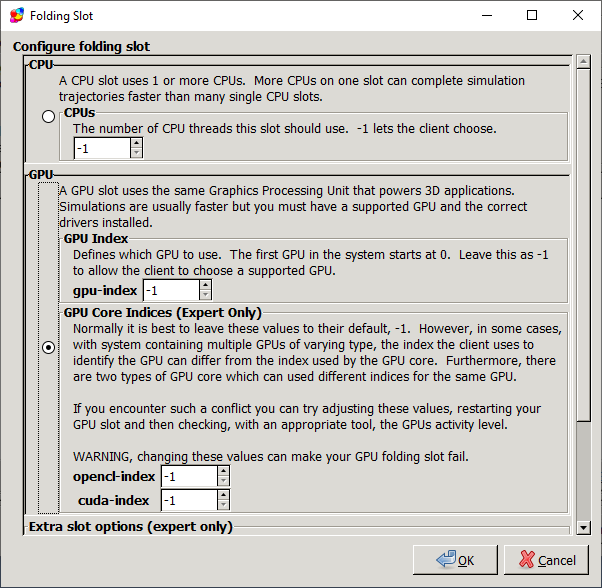
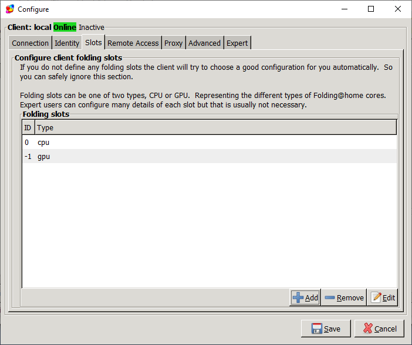
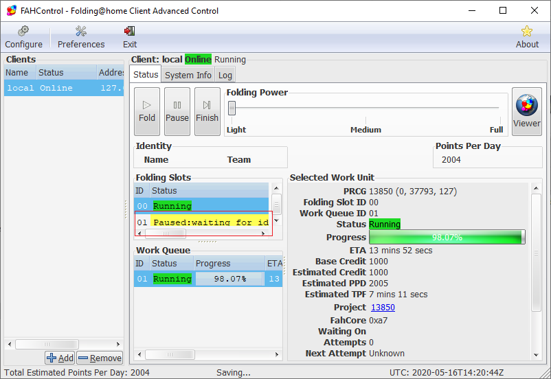

# Download & Windows Install

Honestly, this is very straight forward; you [download](https://foldingathome.org/start-folding/) the client from the website and install it with few clicks. Here are some screenshots. 









# Configure & Start folding

If you are getting a Windows Defender Firewall message, go ahead and allow the FAH client to communicate. 


Once you are done with the installation, a new web page will pop, asking you to either fold as "Anonymous" or set up an identity. We want to help by folding as part the Microsoft team so let's set up an identity and join the Microsoft group (#999)





Once you hit the "Save" button, your machine will start the folding process. 

**Note: it can take up to few minutes for the process to start so no worries one you see the bar showing 0%, this is OK.Short enough, you will start seeing the CPU bar % going up.**




# How does that impact my machine?

Well, the short answer is that the FAH client is a CPU-intensive workload so yeah, don't expect for this thing to go easy on your system. 

You can move the level of "Power" the client is using to fold as well as configuring it to fold only when you are away and the machine is idle. 

In the screenshot below, you can how moving the Power level to "Full" hitting all the CPU cores on my machine.  


# What if my GPU missing?

The FAH client only supports NVIDIA or AMD GPUs and does not support integrated GPUs.  If your system has both an integrated GPU and a discrete NVIDIA/AMD GPU, the FAH client may not automatically configure the discrete GPU.

To configure your GPU, right click the FAH client in the system tray and click **Advanced Control**.



Click **Configure**


Click the **Slots** tab and click **Add**.


Click the **GPU** option and click **OK**.



Click **Save**.



Finally, confirm the new GPU slot was added successfully.



***Note***: If your GPU was not added successfully, it may not have been detected during the install or may not be supported yet.  Consider closing the FAH client, deleting the FAH client configuration at ```%appdata%\FAHClient```, and attempting to install the latest FAH client.

# I closed my browser and I want to re-open the web client page

No problem! just put http://localhost:7396/ or http://127.0.0.1:7396/ and you are good to go again. 

Notice the warning saying "Quitting the browser will not stop folding. Folding happens in a background process on your computer through the program FAHClient even when Web Control is closed."

# I am done, what now?

Nothing really. The more you are folding the more you are contributing so keep at it as long as you want - it is really up to you. 
